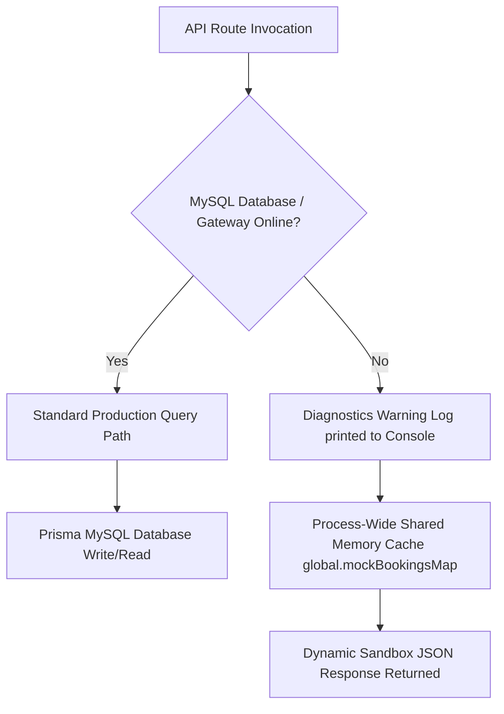

# RSM Wave Valley — Full-Stack Master System Handoff & Technical Specification

Welcome to the definitive system handoff specification manual for **RSM Wave Valley Water Park & Resort** (Malari, Gonda, Uttar Pradesh).

This master document is written to serve as a comprehensive reference guide for an incoming database/backend developer to understand the full-stack system architecture, API contracts, in-memory resilient fallbacks, and the exact steps required to migrate the codebase to a live production database and gateway environment.

---

## 📂 Table of Contents
1.  **Project Overview**
2.  **Customer Journey**
3.  **Admin Journey**
4.  **Frontend Architecture**
5.  **Backend Architecture**
6.  **Database Design**
7.  **API Contract Overview**
8.  **Current System Status**
9.  **Production Readiness Assessment**
10. **Remaining Work (Prioritized Checklist)**
11. **End-to-End Flow Diagram**
12. **Developer Notes & Technical Assumptions**

---

## 🌊 1. Project Overview

### A. What RSM Wave Valley Is
**RSM Wave Valley Resort & Water Park** is a premier local recreational resort located in Malari, Gonda, Uttar Pradesh. To streamline guest intake, ticketing, and booking auditing, the resort utilizes this unified, custom water park management system.

### B. Business Objectives
1.  **Automate Ticketing**: Allow guests to book admission tickets online, pay securely, and download verified, high-contrast, sunlight-readable PDF tickets containing unique QR codes.
2.  **Secure Admittance**: Enable gate operators at the water park's entry points to scan ticket QR codes using mobile devices, instantly validating visit eligibility.
3.  **Prevent Double-Entry**: Strictly enforce single-use entry checks to eliminate duplicate tickets or unauthorized admittance.
4.  **Operational Auditing**: Compile real-time daily operational statistics (today's paid bookings, visitor slot sums, paid revenue metrics, and entry check-ins) to assist resort managers in tracking daily intake.

---

## 🚶 2. Customer Journey

The guest journey transitions from booking submission to entering the water park gates:

### Step 1: Landing Page
*   **Action**: The customer visits the landing page (`/`). They browse showcasing galleries, rides details, resort amenities, contact cards, and call-to-action sections.
*   **aesthetics**: Harmonies of blue colors, outfit typography, animations, and rounded buttons matching premium resort branding. Wildcard public menus *never* link to the administrative backend path `/admin`.

### Step 2: Booking Form & Validation
*   **Action**: Clicking "BOOK NOW" launches the interactive reservation wizard (`/booking`).
*   **Inputs**:
    *   *Guest Name*: Min 2 characters.
    *   *Contact Email*: Standard format verification.
    *   *Mobile Phone*: Stripped to a clean 10-digit number.
    *   *People Count*: Supported guest count strictly restricted from **1 to 10 guests** per booking.
    *   *Visit Date*: Calendar date checker (blocks yesterday or earlier dates).
*   **Pricing**: Computes ₹650 per guest standard fee. Total fee = `peopleCount * 650`.

### Step 3: Payment Integration (Razorpay)
*   **Action**: Submitting the form triggers a REST request to generate the booking row.
*   **Modal Overlay**: On successful API returns, the client-side service pulls Razorpay's overlay script and launches a custom Razorpay payment checkout modal configured in local currency (INR, paise).
*   **Success Callback**: Completing the payment triggers the signature verification webhook REST request, passing checkout order keys.

### Step 4: E-Ticket PDF Generation & Download
*   **Action**: Payment verification sets the booking payment status to `'PAID'` and triggers a server-side PDFKit writer.
*   **PDF Contents**: Compiles dynamic high-contrast details containing guest name, booking identifier, visit date, people count, amount, and an embedded custom QR code containing plain ticket parameters.
*   **Client Download**: The client browser polls the ticket compile status. Once complete, it retrieves the URL path and triggers a virtual `<a>` element download, saving `RSM-Ticket-${bookingId}.pdf` to local storage.

### Step 5: Gate Admission
*   **Action**: The guest arrives at the resort gate, presenting their printed or digital ticket. Gate staff scans the QR code to allow verification, and clicks "ALLOW ENTRY" to mark the ticket as `'USED'`.

---

## 🔒 3. Admin Journey

Administrative functions are kept private under `/admin` routes.

### Step 1: PIN Passcode Authentication Gate (`/admin`)
*   **Screen**: PinScreen display rendering a custom numeric keypad.
*   **Passcode**: Staff enters the validated 6-digit PIN: **`458921`**.
*   **Session State**: Valid inputs authenticate the operator session and save the credential in the browser's `sessionStorage` cache. This locks administrative dashboards from public URL accesses while preserving active operator sessions across page refreshes.

### Step 2: Manager Dashboard Metrics (`/admin/dashboard`)
*   **Screen**: DashboardHome metrics roster.
*   **Aggregates**: Displays today's compiled water park KPIs:
    *   *Today's Bookings*: Count of reservations created today.
    *   *Expected Visitors*: Sum of peopleCount scheduled to visit today.
    *   *Today's Earnings*: Sum of totalAmounts for PAID tickets visiting today.
    *   *Verified Admissions*: Count of guests already checked-in today (`isCheckedIn: true`).

### Step 3: Reservation Board Ledger (`/admin/bookings`)
*   **Screen**: BookingsList reservation board.
*   ** Roster**: Fetches and renders all bookings stored in the database sorted chronologically descending by ID, containing badges indicating payment statuses (`PAID`, `PENDING`) and check-in statuses (`USED`, `VALID`).

### Step 4: Gate QR Scanner Validator (`/admin/verify-ticket`)
*   **Screen**: VerifyTicket handheld scanner camera frame.
*   **Action**: Uses `html5-qrcode` to parse QR payloads, immediately requesting the backend verification state.
*   **Gate Badges**: Renders high-contrast, outdoor-readable status badges:
    *   **`VALID`**: Green badge. Paid booking, visit date is today, and guest has not checked-in yet.
    *   **`UNPAID`**: Slate badge. Booking unpaid.
    *   **`USED`**: Red badge. Guest already checked-in; blocks duplicate entrances.
    *   **`EXPIRED`**: Red badge. Visit date is in the past.
    *   **`NOT_VALID_YET`**: Orange badge. Visit date is in the future.
    *   **`NOT_FOUND`**: Red badge. Missing record.

### Step 5: Check-in Committal (`/admin/checkin-history`)
*   **Action**: On displaying a `VALID` badge, staff clicks "ALLOW ENTRY". This marks `isCheckedIn: true`, records the check-in time in the row, and appends the guest details to the check-in history logs roster.

---

## ⚛️ 4. Frontend Architecture

The frontend is built using **React (Vite)** and styled with **Tailwind CSS**.

### A. Routing Architecture (`App.jsx`)
Exclusively uses `react-router-dom` (`BrowserRouter`) to decouple routes:

```jsx
// src/App.jsx
<BrowserRouter>
  <Routes>
    {/* Public Customer Routes */}
    <Route element={<ClientLayout />}>
      <Route path="/" element={<Home />} />
      <Route path="/booking" element={<Booking />} />
      <Route path="/gallery" element={<Gallery />} />
      <Route path="/resort" element={<Resort />} />
      <Route path="/contact" element={<Contact />} />
    </Route>

    {/* Protected Administrative Operational Routes */}
    <Route element={<AdminAuthProvider />}>
      <Route path="/admin" element={<PinScreen />} />
      <Route element={<AdminLayout />}>
        <Route path="/admin/dashboard" element={<DashboardHome />} />
        <Route path="/admin/bookings" element={<BookingsList />} />
        <Route path="/admin/verify-ticket" element={<VerifyTicket />} />
        <Route path="/admin/checkin-history" element={<CheckinHistory />} />
      </Route>
    </Route>
  </Routes>
</BrowserRouter>
```

### B. Core Services Layers (`src/services/`)
AJAX actions are routed through standard fetch client wrappers inside [apiClient.js](file:///c:/Users/kushw/OneDrive/Desktop/testing_rsm/rsmwave-main/src/utils/apiClient.js):
*   `bookingService.js`: Submits reservations, pulls dynamic configuration prices, and checks dates remaining capacities.
*   `paymentService.js`: Requests order creation, verifies signatures, and launches Razorpay checkout modules.
*   `ticketService.js`: Polls compiler status loops and compiles file downloads.
*   `adminService.js`: Manages admin PIN checks, KPIs aggregates, scans, and audit check-ins.

### C. State Hooks & Session Contexts (`src/hooks/`)
*   `useBooking.js`: Tracks the progress states of guest checkout stages.
*   `useAdminAuth.jsx`: Standard context provider that validates local `sessionStorage` tokens, keeping admin views private.

---

## ⚙️ 5. Backend Architecture

The backend is built as a modular REST API using **Node.js (Express)** and **Prisma ORM**.

```text
server/
├── prisma/
│   └── schema.prisma        # Prisma DB relational configuration models
└── src/
    ├── app.js               # Primary Express server and static mounting
    ├── config/
    │   ├── prisma.js        # Prisma client pool initialization
    │   └── razorpay.js      # Razorpay client integration SDK key loader
    ├── controllers/
    │   ├── adminController.js    # Renders aggregates, rosters, scan checks, & check-ins
    │   ├── bookingController.js  # Handles guest creations
    │   ├── capacityController.js # Aggregates visitor slots sold per date
    │   ├── configController.js   # Exposes pricing structures
    │   ├── paymentController.js  # Renders payment orders & HMAC signature verifications
    │   └── ticketController.js   # Polls compiler status
    ├── middleware/
    │   ├── auth.js          # Validates administrative request header PINs
    │   ├── rateLimiter.js   # Limits client IPs request hits
    │   └── validator.js     # Sanitizes and validates incoming body parameters
    ├── routes/
    │   ├── adminRoutes.js   # Maps admin operational endpoints
    │   ├── bookingRoutes.js # Maps guest creation
    │   ├── capacityRoutes.js# Maps capacity checkers
    │   ├── configRoutes.js  # Maps pricing config retrieval
    │   ├── paymentRoutes.js # Maps order creation and verification
    │   └── ticketRoutes.js  # Maps ticket status polls
    ├── services/
    │   └── ticketService.js # Compiles PDF kit files and embeds dynamic QRs
    └── utils/
        └── generateBookingId.js # Formulates alphanumeric booking keys
```

---

## 🗄️ 6. Database Design (Prisma)

Below is the complete database structure configured in `schema.prisma`:

```prisma
model Booking {
  id             Int       @id @default(autoincrement())
  bookingId      String    @unique
  name           String
  email          String
  mobile         String
  peopleCount    Int
  visitDate      DateTime
  totalAmount    Float
  paymentStatus  String    @default("PENDING")
  isCheckedIn    Boolean   @default(false)
  checkedInAt    DateTime?
  createdAt      DateTime  @default(now())
  updatedAt      DateTime  @updatedAt
  payment        Payment?
  ticket         Ticket?

  @@index([visitDate])
  @@index([createdAt])
  @@index([paymentStatus, isCheckedIn])
}

model Payment {
  id                    Int       @id @default(autoincrement())
  bookingId             Int       @unique
  razorpayOrderId       String
  razorpayPaymentId     String?   @unique
  razorpaySignature     String?
  status                String    @default("PENDING")
  paidAt                DateTime?
  booking               Booking   @relation(fields: [bookingId], references: [id])
}

model Ticket {
  id             Int       @id @default(autoincrement())
  bookingId      Int       @unique
  ticketUrl      String
  generatedAt    DateTime  @default(now())
  booking        Booking   @relation(fields: [bookingId], references: [id])
}
```

---

## 🗺️ 7. API Contract Overview

Every endpoint uses JSON request and response payloads.

### A. Guest Endpoints

#### 1. `POST /api/bookings/create`
*   **Purpose**: Creates a guest reservation.
*   **Request Payload**:
    ```json
    {
      "name": "Aarav Sharma",
      "email": "aarav@example.com",
      "mobile": "9876543210",
      "peopleCount": 4,
      "visitDate": "2026-06-15T00:00:00.000Z"
    }
    ```
*   **Expected Response**:
    ```json
    {
      "success": true,
      "message": "Booking created successfully",
      "booking": {
        "id": 1,
        "bookingId": "RSM-192841",
        "name": "Aarav Sharma",
        "email": "aarav@example.com",
        "mobile": "9876543210",
        "peopleCount": 4,
        "visitDate": "2026-06-15T00:00:00.000Z",
        "totalAmount": 2600,
        "paymentStatus": "PENDING"
      }
    }
    ```

#### 2. `POST /api/payments/create-order`
*   **Purpose**: Issues Razorpay transaction order credentials.
*   **Request Payload**: `{ "bookingId": "RSM-192841" }`
*   **Expected Response**:
    ```json
    {
      "success": true,
      "order": {
        "id": "order_PKyD824uG",
        "amount": 260000,
        "currency": "INR",
        "receipt": "RSM-192841"
      },
      "booking": {
        "bookingId": "RSM-192841",
        "totalAmount": 2600
      }
    }
    ```

#### 3. `POST /api/payments/verify-payment`
*   **Purpose**: Verifies Razorpay checkout HMAC signatures and compiles ticket PDFs.
*   **Request Payload**:
    ```json
    {
      "razorpay_order_id": "order_PKyD824uG",
      "razorpay_payment_id": "pay_PKyJ891sQ",
      "razorpay_signature": "abcdef123456789...",
      "bookingId": "RSM-192841"
    }
    ```
*   **Expected Response**:
    ```json
    {
      "success": true,
      "message": "Payment verified successfully",
      "paymentId": "pay_PKyJ891sQ",
      "ticket": "/tickets/RSM-192841.pdf"
    }
    ```

#### 4. `GET /api/tickets/status/:bookingId`
*   **Purpose**: Allows frontend to poll and verify when PDF ticket finishes compiling.
*   **Expected Response**: `{ "ready": true, "ticketUrl": "/tickets/RSM-192841.pdf" }`

#### 5. `GET /api/config/pricing`
*   **Purpose**: Exposes dynamic price scales.
*   **Expected Response**: `{ "ticketPrice": 650, "adultPrice": 650, "childPrice": 400, "weekendPrice": 750, "holidayPrice": 800 }`

#### 6. `GET /api/capacity?date=YYYY-MM-DD`
*   **Purpose**: Calculates date slots remaining capacity.
*   **Expected Response**: `{ "totalCapacity": 1000, "remainingCapacity": 960, "soldOut": false }`

---

### B. Admin Endpoints

#### 1. `POST /api/admin/verify-pin`
*   **Purpose**: Enforces administrative login.
*   **Request Payload**: `{ "pin": "458921" }`
*   **Expected Response**: `{ "success": true }`

#### 2. `GET /api/admin/dashboard`
*   **Purpose**: Compiles today's operational dashboard metrics KPIs.
*   **Expected Response**: `{ "todayBookings": 12, "todayVisitors": 38, "todayRevenue": 24700, "verifiedTicketsToday": 14 }`

#### 3. `GET /api/admin/bookings`
*   **Purpose**: Fetches chronological bookings list sorted desc by id.
*   **Expected Response**: Array of complete Booking rows.

#### 4. `POST /api/admin/verify-ticket`
*   **Purpose**: Resolves scanned gate QR payloads.
*   **Request Payload**: `{ "bookingId": "RSM-192841" }`
*   **Expected Response**: `{ "bookingId": "RSM-192841", "name": "...", "mobile": "...", "visitDate": "...", "guestCount": 4, "amount": 2600, "paymentStatus": "PAID", "verificationStatus": "VALID" }`

#### 5. `POST /api/admin/checkin`
*   **Purpose**: Records entry check-ins.
*   **Request Payload**: `{ "bookingId": "RSM-192841" }`
*   **Expected Response**: `{ "success": true, "status": "USED" }`

#### 6. `GET /api/admin/checkins`
*   **Purpose**: Retrieves checked-in admissions history list.
*   **Expected Response**: Array of check-in objects.

---

## 🔍 8. Current System Status

All Express backend endpoints operate in a **HYBRID** architectural state designed to remain fully functional, offline-resilient, and sandbox-testable without database connections or live gateways.



### Endpoints Audit Classification Ledger:

1.  **`POST /api/bookings/create`** (HYBRID):
    *   *Attempt*: Writes row using `prisma.booking.create()`.
    *   *Fallback*: If database connection fails, logs detail traces to terminal, creates dynamic guest mock bookings row, and saves inside process cache.
2.  **`POST /api/payments/create-order`** (HYBRID):
    *   *Attempt*: Searches `prisma.booking` and contacts Razorpay Orders API.
    *   *Fallback*: Loads mock booking from process cache and generates dynamic mock Razorpay order.
3.  **`POST /api/payments/verify-payment`** (HYBRID):
    *   *Attempt*: Cryptographically verifies live signature. Saves `Payment` and `Booking` status updates in MySQL.
    *   *Fallback*: Bypasses signatures for mock orders. Marks status `'PAID'` inside process cache and generates PDF.
4.  **`POST /api/admin/verify-pin`** (FULL MOCK):
    *   *Mechanism*: Compares input parameter against system variable properties. Uses no database tables.
5.  **`GET /api/admin/dashboard`** (HYBRID):
    *   *Attempt*: Runs Prisma aggregates and counts for today's logs.
    *   *Fallback*: Compiles counts and sums in-memory from process cache items.
6.  **`GET /api/admin/bookings`** (HYBRID):
    *   *Attempt*: Finds many bookings using Prisma.
    *   *Fallback*: Returns process cache entries sorted desc by ID.
7.  **`POST /api/admin/verify-ticket`** (HYBRID):
    *   *Attempt*: Resolves scanned ticket row via Prisma unique searches.
    *   *Fallback*: Finds ticket inside process cache. Enforces 5 gate status states.
8.  **`POST /api/admin/checkin`** (HYBRID):
    *   *Attempt*: Updates database row status to `isCheckedIn: true`.
    *   *Fallback*: Mutates check-in state inside process cache.
9.  **`GET /api/admin/checkins`** (HYBRID):
    *   *Attempt*: Queries checked-in records.
    *   *Fallback*: Filters and maps checked-in entries from process cache.
10. **`GET /api/tickets/status/:bookingId`** (HYBRID):
    *   *Attempt*: Searches `prisma.ticket.findUnique()`.
    *   *Fallback*: Returns `{ ready: false }`.
11. **`GET /api/config/pricing`** (FULL MOCK):
    *   *Mechanism*: Exposes pricing schemas directly. Operates 100% production-ready.
12. **`GET /api/capacity`** (HYBRID):
    *   *Attempt*: Computes paid tickets sums.
    *   *Fallback*: Returns standard maximum park capacity of 1000 slots.

---

## 📈 9. Production Readiness Assessment

Below is the readiness scorecard, summarizing what is verified complete, what is partially written, and what remains missing:

### 1. Frontend Client Layer: **`100% READY`**
*   **Complete**: All client and administrative screens are fully written. Router guards, persistence contexts, scanners, and custom stylings are fully verified. No work remains.

### 2. Backend Server Controllers: **`65% READY`**
*   **Complete**: REST endpoints, custom rate-limiting middlewares, header admin auth checks, payload sanitization validators, static ticket directories serving, and PDF Kit compiler services are completed.
*   **Partially Complete**: Controllers operate in **HYBRID** fallback mode to allow local testing when MySQL and Razorpay are down.
*   **Missing**: Active live Razorpay webhook handlers, S3 persistent file storage adapters, and SMS/Email messaging.

### 3. Database Schema: **`80% READY`**
*   **Complete**: Complete relational schemas created. Columns, types, and primary tables mapped.
*   **Missing**: Table creation execution via migrations on production MySQL. Relational cascade deletes and index bounds optimizations.

### 4. Live Gateway Integrations: **`40% READY`**
*   **Complete**: Razorpay order API integrations and signature HMAC verifies are written.
*   **Missing**: Production payment captures and webhook validations.

---

## 📋 10. Remaining Work (Checklist)

Below is the chronological prioritized roadmap for the backend engineer to take the system 100% live:

```text
Phase 1: DB & Schema
[npx prisma migrate dev]
  └── Phase 2: Auth Security
      [JWT / Admin Auth Gates]
        └── Phase 3: Razorpay Webhooks
            [POST /api/payments/webhook]
              └── Phase 4: S3 PDF Storage
                  [AWS S3 Transient Adapter]
                    └── Phase 5: Twilio & SMTP
                        [SMS/Email Ticket Alert]
```

### 🔴 Phase 1: Database Migration & Schema Optimizations
1.  [ ] Configure live MySQL credentials inside `/server/.env` under the `DATABASE_URL` property.
2.  [ ] Execute schema migrations to push tables and indexes:
    ```bash
    npx prisma migrate dev --name init_rsm_valley_relational_schema
    ```
3.  [ ] Regenerate client hooks: `npx prisma generate`.
4.  [ ] Apply cascading deletions (`onDelete: Cascade`) to relations in `schema.prisma`.

### 🟠 Phase 2: Administrative REST API Authorization
5.  [ ] secure all admin API routes under `/api/admin/*` by validating token payloads (JWT) or verifying PIN credentials in request headers.
6.  [ ] Encrypt administrative passcodes using secure salted hashes (e.g. bcrypt) instead of plaintext configurations.

### 🟠 Phase 3: Webhooks & Concurrency Locks
7.  [ ] Implement dynamic webhooks captures: register `POST /api/payments/webhook` to record transactions asynchronously.
8.  [ ] Wrap payment verifications and admissions inside transaction blocks (`prisma.$transaction`) using row-level locking (`SELECT ... FOR UPDATE`) to prevent concurrent double-admittance or signature reuses.

### 🟡 Phase 4: S3 Persistent File Storage
9.  [ ] Install AWS SDK packages inside `/server` dependencies.
10. [ ] Refactor [ticketService.js](file:///c:/Users/kushw/OneDrive/Desktop/testing_rsm/rsmwave-main/server/src/services/ticketService.js) to stream generated PDFs directly to an Amazon S3 bucket, saving S3 links to `Ticket.ticketUrl`.

### 🟡 Phase 5: Dynamic capacity Limits & Communications
11. [ ] Connect date capacity limit guards in booking controller to reject guest checkouts if paid visitor sums exceed 1000 for a date.
12. [ ] configure Twilio SID and SMTP credentials in environments. Invoke SMS/Email functions inside payment success handlers to send ticket links immediately.

---

## ⚙️ 11. End-to-End Flow Diagram

### A. Customer Checkout & E-Ticket Generation Flow
```text
Customer            Frontend Client           Express Server          Prisma MySQL          Razorpay API
   │                       │                         │                     │                      │
   │── Fill Out Wizard ───>│                         │                     │                      │
   │   (Name, Phone, Date) │                         │                     │                      │
   │                       │── POST /bookings/create ───────>│                     │                      │
   │                       │   (Validate Body)       │── Save Booking ────>│                      │
   │                       │                         │   (PENDING)         │                      │
   │                       │<── Return Booking details ──────│                     │                      │
   │                       │                         │                     │                      │
   │                       │── POST /payments/create-order ─>│                      │                      │
   │                       │                         │── Generate Order ─────────────────────────>│
   │                       │                         │                     │<── Return order_id ──│
   │                       │<── Return order details ────────│                     │                      │
   │                       │                         │                     │                      │
   │<── Render Checkout ───│                         │                     │                      │
   │── Pay and Authenticate│                         │                     │                      │
   │   (Razorpay Popup)    │                         │                     │                      │
   │                       │── POST /verify-payment ────────>│                     │                      │
   │                       │   (Pass Signatures)     │── Validate HMAC ────│                      │
   │                       │                         │── Update (PAID) ───>│                      │
   │                       │                         │── Write Payment ───>│                      │
   │                       │                         │── Compile Ticket PDF│                      │
   │                       │                         │── Write Ticket ────>│                      │
   │                       │<── Return Ticket URL ───│                     │                      │
   │                       │                         │                     │                      │
   │<── Download PDF Ticket│                         │                     │                      │
```

### B. Entry Gate Scanning & Admittance Flow
```text
Gate Operator         scanner (HTML5)         Express Server          Prisma MySQL          Gate Admittance
    │                       │                       │                      │                       │
    │── Scan ticket QR ────>│                       │                      │                       │
    │                       │── POST /verify-ticket ───────>│                      │                       │
    │                       │   (Pass Booking ID)   │── DB Row Lookup ────>│                       │
    │                       │                       │── check status       │                       │
    │                       │                       │   (VALID / USED)     │                       │
    │                       │<── Return gate Badge ─│                      │                       │
    │                       │                       │                      │                       │
    │<── Render Badge Color │                       │                      │                       │
    │── Click "ALLOW ENTRY" ───────────────────────>│                      │                       │
    │                       │                       │── POST /checkin ────>│                       │
    │                       │                       │   (Update row)       │                       │
    │                       │                       │   (isCheckedIn: true)│                       │
    │                       │                       │                      │── Guest Admitted ────>│
    │<── Admission Success ─────────────────────────│                      │                       │
```

---

## 📝 12. Developer Notes & Technical Assumptions

1.  **TimeZone Safety (Midnight Admittance Glitch)**:
    *   *Warning*: Server local time comparisons will cause validation bugs if the remote host (e.g. UTC) differs from IST.
    *   *Rule*: Always shift system date objects to Indian Standard Time (`UTC+5:30`) using explicit parsing parameters before validating ticket date ranges.
2.  **Concurrency Locks (Double Admittance Prevention)**:
    *   *Warning*: Sequential database queries are vulnerable to race conditions where the same barcode is scanned at different gate client devices simultaneously.
    *   *Rule*: Use transactional locks (`SELECT ... FOR UPDATE`) in MySQL inside check-in handlers to block duplicate entries.
3.  **Local static storage (PDF compilation persistence)**:
    *   *Warning*: Ticket PDFs stored locally inside `tickets/` will be deleted on every container restart if hosted on transient cloud environments (like Heroku or AWS Fargate).
    *   *Rule*: Implement AWS S3 SDK cloud streaming adapters in production environments.
4.  **Admin Route Authorization Isolation**:
    *   *Warning*: Administrative endpoints are unprotected from direct REST requests.
    *   *Rule*: Mount secure header checks (`x-admin-pin`) or JWT security validators on all administrative routing paths.
